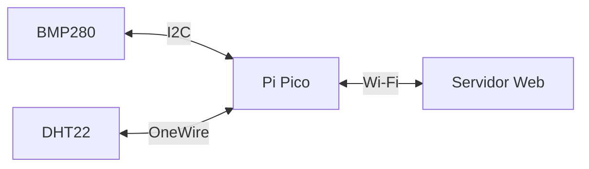

# Estação climática com Pi Pico

## Descrição do Projeto

O objetivo do projeto foi desenvolver um sistema que possua a capacidade de medir dados climáticos do ambiente e enviá-los a um servidor web para melhor visualização e possível armazenamento.

### Diagrama 

O diagrama abaixo apresenta o fluxo da informação no sistema

## Componentes utilizados

## Linguagem usada

## Código

## Resultados
