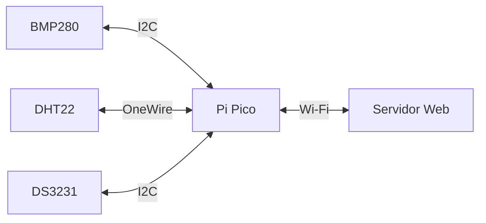

# Estação climática com Pi Pico

## Descrição do Projeto

O objetivo do projeto foi desenvolver um sistema que possua a capacidade de medir dados climáticos do ambiente e enviá-los a um servidor web para melhor visualização e possível armazenamento.

### Diagrama 

O diagrama abaixo apresenta o fluxo da informação no sistema

### Funcionamento esperado

Do diagrama anterior, deverá se estabelecer uma conexão física entre os três sensores e a a Pico para que a comunicação entre ambos seja possibilitada. Além disso, será necessário desenvolver um código que possibilite a leitura das informações provenientes deles. Após a leitura, deverá ser necessário desenvolver uma página web (website) para apresentar os dados no navegador e escolher como a conexão entre essa página se dará.

Em suma, seguimos os seguintes passos para desenvolver o sistema:
1. Conectar fisicamente todos os componentes;
2. Desenvolver três funções (uma para cada sensor) para coletar as informações que eles enviam;
3. Criar uma página web em html, por simplicidade;
4. Criar uma função que conecte o microcontrolador à internet;
5. Escolher o protocolo de comunicação do micro para a internet;
6. Fazer um loop infinito que abrigue as funcionalidades do software que sempre deverão ser refeitas (leitura e envio dos dados);

### Protocolo de comunicação com a internet

Os outros pontos ou são auto explicativos, ou serão explicados na seção "Código", mas esse é necessário uma maior explicação sobre o motivo de termos escolhido sockets para nos comunicarmos com a internet.
Poderíamos utilizar o protocolo HTTP e fazer, por exemplo, requisição do tipo POST para atualizar o website, porém isso se tornaria mais lento e, como não possuímos um DNS, iria ser necessário fazer essas requisições para um endereço de IP a cada atualização. Esse procedimento, além de trabalhoso, não seria eficaz pela necessidade de passar novamente todas as informações em um body com algum tipo de autenticação para que outros na mesma rede não consigam enviar requisições.

Por isso, o melhor procedimento para esse caso é o socket. Ele abre uma requisição e mantém a conexão aberta para continuar com o envio de dados sem que seja necessário passar todos os parâmetros da requisição novamente, apenas os dados que necessitam ser atualizados.

Ademais, outro ponto importante é a escolha da utilização de um sensor para medir tempo ao invés de se usar uma API. Essa decisão foi tomada pensando em liberar o máximo de processamento do microcontrolador para que as medições tomadas possam ser precisas e acontecer no tempo desejado.

## Componentes utilizados
Neste projeto foram utilizados três sensores diferentes para obter todas as informações climáticas relevantes, juntamente com a hora atual. Estes são
* DHT22: Obtém dados de temperatura e umidade relativa do ar
* BMP280: Obtém dados de temperatura e pressão atmosférica
* DS3231: *Real time Clock* para atribuir leituras temporais às outras medidas
* Placa de desenvolvimento BITDOGLAB com o microcontrolador Raspberry Pi Pico
* Jumpers e protoboard para conectar os sensores à placa

## Linguagem usada
Utilizou-se a linguagem micropython devido à facilidade na configuração de componentes e a grande disponibilidade de bibliotecas compatíveis com os sensores e as funcionalidades utilizadas.
Bibliotecas utilizadas:
* machine
* bmp280
* time
* socket
* network
* dht
* urtc

obs: As bibliotecas bmp280 e urtc não são nativas do micropython. Dessa forma, usando a IDE Thonny, os arquivos bmp280.py e urtc.py foram salvos na Pico para que fosse possível usar os recursos delas.

## Código

O código principal está no arquivo `main.py` e abriga todas as funções bem como o seu método de uso.

Algo relevante a se comentar é que os dados do wifi foram *hardcoded* no código, o que não é recomendado, tendo sido feito apenas por simplicidade. O ideal seria criar variáveis de ambiente para armazenar esses valores e apenas usar eles sem explicitá-los.

Após as definições das constantes do projeto: [Pinos dos sensores, nome e senha do wifi, tipo do sensor DHT: 11 ou 12, tipo do sensor RTC: DS3231, DS1307 ou PCF8523] são definidas as funções explicitadas na subseção "Funcionamento esperado", em que:
* `set_time`: Função para inserir a hora local no RTC, não requer parâmetros e não tem retorno.
  
* `wifi_connect`: Função para conectar ao wifi. Recebe um parâmetro opcional tentativas que representa o número de tentativas e retorna o servidor.

* `get_temp_press`: Função para ler a temperatura e a pressão do BMP280. Não requer nenhum parâmetro e retorna a temperatura e a pressão.

* `get_umid`: Função para ler a umidade do DHT22. Não requer nenhum parâmetro e retorna a umidade.
  
* `get_time`: Função para ler e formatar a hora atual do RTC, não requer parâmetros e retorna a hora formatada.

* `web_page`: Função para configurar a página web.# Recebe os valores de temperatura (BMP e DHT), pressão e umidade e retorna o html para o site.

Além disso, também existem as funções que começam com 'config', seu objetivo é configurar cada sensor e retornar um objeto com as configurações cada tenha tido sucesso na operação.

## Resultados
O resultado está apresentado na imagem abaixo, que mostra o funcionamento do site, com os valores recebidos pela Pico através do Wi-Fi.

A seguir, temos um vídeo que mostra o site se atualizando em tempo real com novos dados a cada 5s.

https://github.com/user-attachments/assets/d1fb7aea-b91a-448c-b332-6fe8dec15ac4
